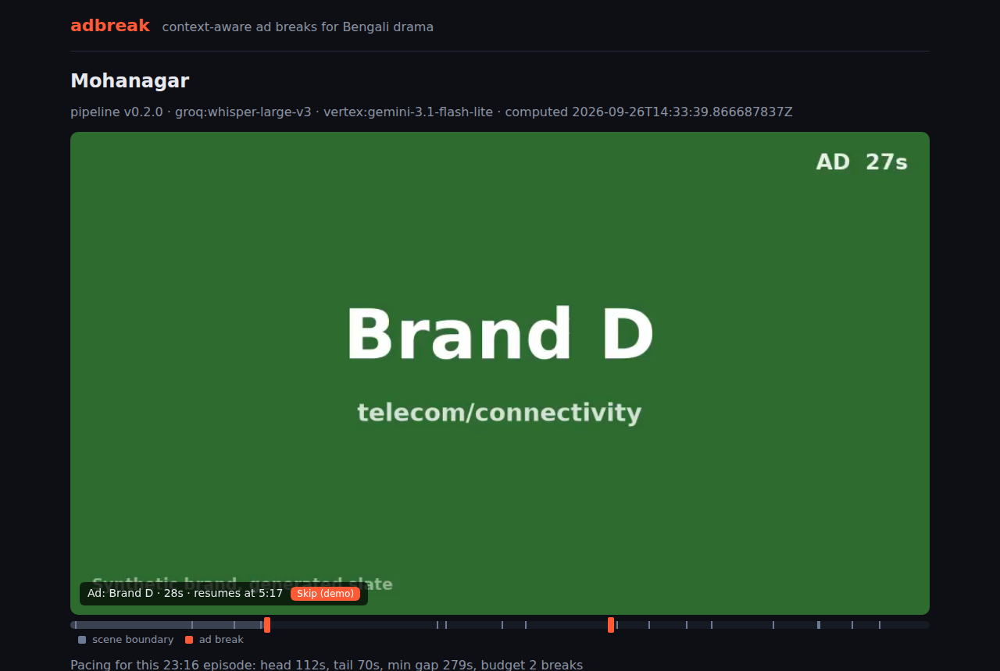
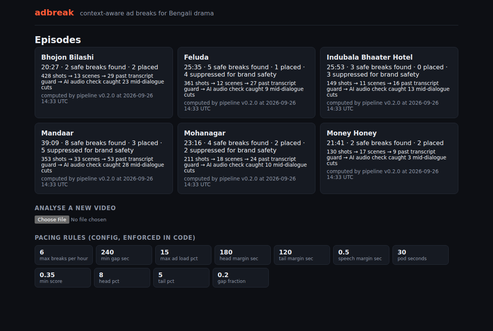
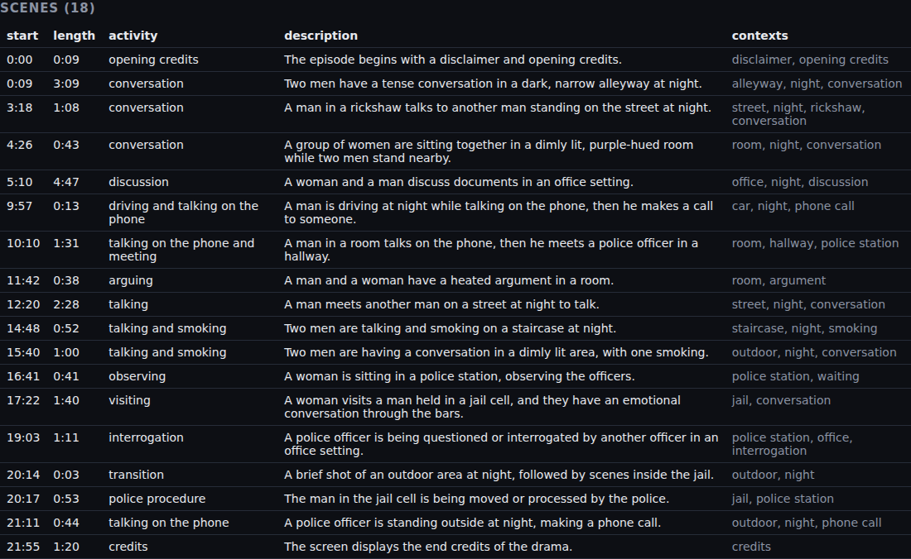
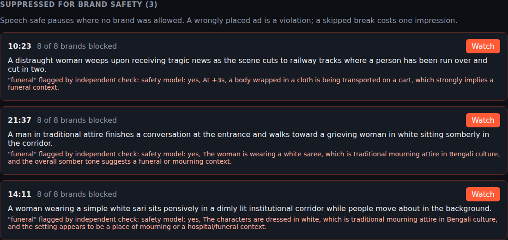
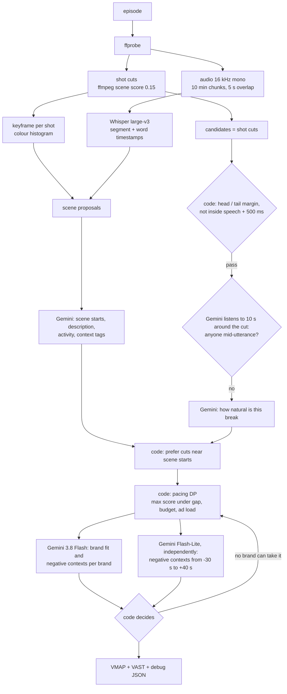
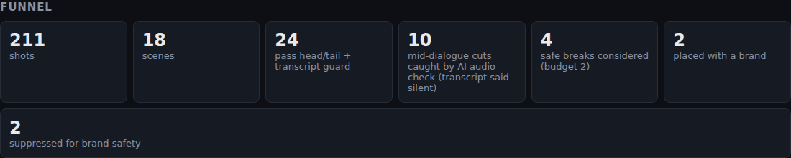
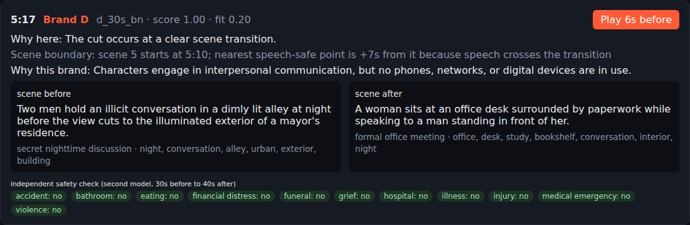
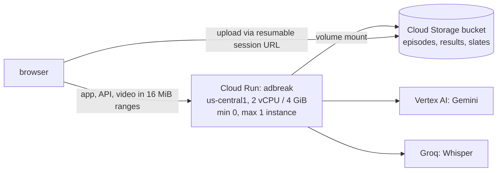

<div align="center">

# adbreak

**Context-aware ad breaks for long-form Bengali drama.**
Finds where an ad can interrupt a story without cutting anyone off, decides whether a break is warranted at all, and picks the brand that fits the moment, refusing any placement that would sit next to a funeral, violence or anything else a brand has ruled out.

[](https://github.com/thisizaro/adbreak/actions/workflows/ci.yml)


**[Live demo: adbreak.aranyadutta.dev](https://adbreak.aranyadutta.dev)** ·
[Architecture](docs/ARCHITECTURE.md) ·
[Decision log](docs/LOG.jsonl) ·
[Scope](docs/SCOPE.md)



</div>

Built solo in 12 hours for **hoichoi Hackathon'26, Problem 1: Context-Aware Video Segmentation and Intelligent Ad Placement**.

---

## Contents

- [What it does](#what-it-does)
- [Results on the sample episodes](#results-on-the-sample-episodes)
- [How it works](#how-it-works)
- [AI proposes, code guarantees](#ai-proposes-code-guarantees)
- [Why it is deliberately conservative](#why-it-is-deliberately-conservative)
- [Outputs](#outputs)
- [Architecture](#architecture)
- [Running locally](#running-locally)
- [Configuration](#configuration)
- [HTTP API](#http-api)
- [Deployment](#deployment)
- [Cost and abuse controls](#cost-and-abuse-controls)
- [Testing](#testing)
- [Known limitations](#known-limitations)
- [Roadmap](#roadmap)
- [Project documents](#project-documents)

---

## What it does

Give it an episode. It returns:

| | |
|---|---|
| **Scenes** | The episode segmented into semantically coherent scenes, each with a description, dominant activity and context tags. |
| **Where** | Cut points that never interrupt speech, checked by two independent signals (transcript timing and a model listening to the audio around the cut). |
| **Whether** | Only as many breaks as the pacing rules allow and the story supports: max breaks per hour, minimum gap and ad load, all scaled to episode length. |
| **What** | For each break, the brand whose target contexts match what is actually happening, with every brand's negative contexts enforced as a hard block by code, not by the model. |
| **Manifest** | An IAB VMAP 1.0 schedule with inline VAST 3.0, plus a debug JSON that explains every accept and every reject. |
| **Player** | A web player that reads the VMAP, cuts to the ad at the break and resumes the episode where it left off. |

Brands are loaded from the catalogue at runtime. A ninth brand can be added from the UI and matched against an episode without any code change.

<table>
<tr>
<td width="50%"></td>
<td width="50%"></td>
</tr>
<tr>
<td align="center"><sub>Library: per-episode funnel and the pacing rules in force</sub></td>
<td align="center"><sub>Scene segmentation, judged on its own</sub></td>
</tr>
</table>

## Results on the sample episodes

All six episodes from the hackathon kit, processed by the deployed pipeline (v0.3.0, Gemini on Vertex AI).

| Episode | Length | Shots | Scenes | Cut by the batched audio check | Cut by the final per-break check | Placed | Held back |
|---|---:|---:|---:|---:|---:|---|---:|
| Bhojon Bilashi | 20:27 | 428 | 13 | 23 | 3 | **1** (Brand G at 2:56) | 0 |
| Feluda | 25:35 | 361 | 12 | 9 | 4 | **1** (Brand G at 14:17) | 4 |
| Indubala Bhaater Hotel | 25:53 | 149 | 11 | 13 | 2 | **0** | 1 |
| Mandaar | 39:09 | 353 | 33 | 28 | 5 | **1** (Brand A at 7:48) | 10 |
| Mohanagar | 23:16 | 211 | 18 | 10 | 5 | **1** (Brand D at 9:57) | 5 |
| Money Honey | 21:41 | 130 | 17 | 3 | 4 | **1** (Brand D at 9:19) | 0 |
| **Total** | | | **104** | **86** | **23** | **5** | **20** |

What the numbers say:

- **86 cuts that the transcript said were silent were actually mid-dialogue**, caught by a model listening to the audio around each cut. Whisper timestamps on Bengali are coarse (segments cover about 93% of runtime, some "words" last up to 29 seconds) and on long chunks it can drop dialogue entirely: in Mohanagar it returned nothing for 27 seconds of conversation.
- **23 more were caught by the final check.** Every break the pacing optimizer selects is re-heard on its own by two models (a focused question about 3 seconds either side of the cut). Anything but a clear "no speech" from both rejects it and the optimizer picks again. This is what caught the Mohanagar case: a manual review found a break at 5:17 cutting into *"এমপি সাহেবের পিএস টিটু সাহেবের সাথে আপনার একটা অ্যাপয়েন্টমেন্ট ছিল"*, which the long-form transcript had dropped and the batched check had missed.
- **20 speech-safe breaks were held back** because no brand may appear there, or no brand matches what the scene is mainly about. Indubala Bhaater Hotel gets zero ads on purpose. Its one remaining clean pause, at 14:12, is blocked for every brand; the independent safety model's evidence reads *"The characters are dressed in white, which is traditional mourning attire in Bengali culture, and the setting appears to be a place of mourning"*. (Another pause, at 10:23 beside a body carried on a cart, was already removed by the final speech check.) It is a story about a food hotel, and this is exactly the "food ad after a funeral" case the brief says must never happen. The word "funeral" is never spoken; it is caught from the pictures.
- **Each of the 5 placements was reviewed by hand**: both hearings "no" at the cut, the last transcribed word 1.4 to 3.3 seconds before it, the audio at the cut a pause, music or street ambience, and the frames either side matching the stated scenes and brand (travel over drone shots of the town, travel over a mountain lake, food over a plate of fried fish being served, telecom right after a phone call, twice).

<p align="center"></p>

## How it works

Cheap, deterministic signals run first. AI only looks at what survives. Code has the final say.



1. **Shots and speech.** ffmpeg finds hard cuts. Audio is chunked under the ASR upload limit and transcribed by Whisper large-v3; chunks are stitched at the midpoint of each overlap.
2. **Scenes.** One keyframe per shot. Colour-histogram jumps with no speech across the cut propose scene starts; Gemini, given the keyframes and transcript in windows of 80 shots, confirms the starts and describes each scene. If a window's model call fails, the heuristic proposals stand in for it.
3. **Where.** Every shot cut is a candidate. Code rejects anything inside the head or tail margin or within 500 ms of any transcribed speech. Gemini then hears 10 seconds of audio around each survivor with frames from either side; *yes* or *unsure* on "is anyone mid-utterance" rejects it.
4. **Whether.** Surviving cuts get a natural-break score, nudged up near scene starts and down mid-scene. A dynamic program picks the highest-scoring set that respects the minimum gap, the per-hour rate and the ad-load cap, and drops anything below a minimum score. There is no target number of breaks.
5. **Final check.** Each selected break is re-heard on its own by two models. Anything but a clear "no speech" from both rejects it and the DP re-selects.
6. **What.** For each surviving break, one model scores every brand's fit, says whether the fit is with the scene's *dominant* activity or only something incidental, and answers every negative context before and after the break, while a second model independently checks every negative context in the catalogue over a wider window. Code decides. If no brand can take a break, it is marked with the reason and the DP re-selects so the next-best break gets the slot.

## AI proposes, code guarantees

The model supplies judgment. Rules that the brief treats as non-negotiable are enforced in Go and cannot be overridden by a model answer.

| Rule | Enforced by | Model's role |
|---|---|---|
| Never cut inside speech | `breaks.Filter`: transcript segment or word span widened by 500 ms; then the final check needs a clear "no" from two models | Can reject, never approve what code rejected |
| Dominant scene activity wins | `brands.Decide`: a brand is only eligible if the model says its fit is with the dominant activity (missing answer counts as no) and fit ≥ 0.35 | Supplies the judgment; code applies the rule |
| Pacing (gap, per hour, ad load, head, tail) | `breaks.Select` (DP) and `breaks.MaxBreaks` | None |
| Negative contexts are a hard block | `brands.Decide` | Supplies evidence; code applies the rule |
| New brands need no code | Catalogue loaded at runtime; cache keyed by catalogue hash | Reads whatever brands it is given |

`brands.Decide` fails closed on three paths:

1. **The placement model says *yes* or *unsure*** for any of a brand's negative contexts, in the scene before or after the break.
2. **The placement model leaves something out**: no verdict for a brand, or no answer for one of its negative contexts. A missing answer is treated as *unsure*.
3. **An independent signal flags the context**, even if the placement model said *no*: the second model's safety check over −30 s to +40 s (itself fail closed: an unanswered context is flagged), or a scene tag in that window that matches the context.

The window is in episode time because the ad pauses the story: the viewer sees content up to the break, the ad, then content from the break onwards.

## Why it is deliberately conservative

The brief's pacing rules are ceilings (max breaks per hour, minimum gap, max ad load). There is no minimum break count. The auto-disqualifiers include *any* negative-context violation on the held-out set, and mid-dialogue cuts are "heavily penalised".

So the costs are asymmetric: a wrongly placed break is catastrophic, and a missed break costs one impression. Every uncertain case resolves towards not placing. The debug JSON and the UI show each suppressed break with its evidence, so "0 breaks" always comes with a reason.

## Outputs

**VMAP 1.0 with inline VAST 3.0** (excerpt from the live Mohanagar manifest):

```xml
<vmap:VMAP xmlns:vmap="http://www.iab.net/videosuite/vmap" version="1.0">
  <vmap:AdBreak timeOffset="00:05:17.320" breakType="linear" breakId="break-1">
    <vmap:AdSource id="d_30s_bn" allowMultipleAds="false" followRedirects="true">
      <vmap:VASTAdData>
        <VAST version="3.0">
          <Ad id="d_30s_bn">
            <InLine>
              <AdSystem>adbreak</AdSystem>
              <AdTitle>Brand D</AdTitle>
              <Creatives><Creative id="d_30s_bn"><Linear>
                <Duration>00:00:30</Duration>
                <MediaFiles>
                  <MediaFile delivery="progressive" type="video/mp4" width="960" height="540">…/media/slates/d_30s_bn.mp4</MediaFile>
                </MediaFiles>
              </Linear></Creative></Creatives>
```

**Debug JSON** (`GET /api/episodes/{id}`) contains, among other fields:

| Field | What it holds |
|---|---|
| `funnel` | Shots, scenes, candidates, passes at each gate, `caught_by_ai_audio_check`, `considered_for_placement = placed + suppressed_for_brand_safety` |
| `effective_pacing` | Head, tail, minimum gap and break budget actually applied to this episode |
| `scenes[]` | Start, end, description, dominant activity, context tags, mood, source (`ai` or `heuristic`) |
| `candidates[]` | Every cut with its score, signals, AI rationale, or the reason it was rejected |
| `breaks[]` | Time, score, rationale, both scene reads, every brand verdict, independent safety checks and flags, the decision, blocked brands with reasons, and how the break relates to the nearest scene start |
| `unplaced[]` | Breaks no brand could take, with the same evidence |

**Ad creatives.** The catalogue points at creatives that were not supplied, so each is rendered on first request as a branded slate at its exact duration (15, 20 or 30 s) with ffmpeg. Only the synthetic brand names from the catalogue are ever shown.

<p align="center">
<br>

</p>

## Architecture

A modular monolith: one Go binary, one Cloud Run instance, an in-process event bus. Each module is a package under `internal/` behind a small interface and wired in `cmd/`.

| Package | Responsibility |
|---|---|
| `media` | ffprobe, shot detection, audio chunks, frames, clips |
| `speech` | ASR provider interface; Groq-hosted Whisper; overlap-aware chunk merge |
| `ai` | Model provider interface; Gemini on Vertex AI (Application Default Credentials) or an AI Studio key; per-job token budget |
| `scenes` | Histograms, scene proposals, scene assembly |
| `breaks` | Hard filters, duration-scaled pacing, scene-context scoring, the selection DP |
| `brands` | Catalogue, validation, the fail-closed decision |
| `pipeline` | Stage order, per-stage JSON cache, placement, safety check, re-match |
| `jobs` | Async runner on an in-process bus; one worker; rolling daily cap |
| `slates` | ffmpeg ad slates |
| `manifest` | VMAP and VAST |
| `library` | Read side: results, videos, trials, on-demand slates |
| `server` | HTTP API, media in 16 MiB ranges, upload targets, embedded SPA |
| `web/` | React + TypeScript, built by Vite and embedded with `go:embed` |

**Where it would split into services, and why it does not yet.** `speech` and `ai` already sit behind provider interfaces, so self-hosted Whisper or an open-weights vision model would slot in without touching the pipeline. `jobs` would become an API plus a worker pool on a real queue once more than one instance is needed. Today one instance carries the load, so a broker would add cost and moving parts without adding anything a user sees.

Full diagrams (modules, pipeline, brand decision, upload sequence, deployment) are in [docs/ARCHITECTURE.md](docs/ARCHITECTURE.md). Each one is rendered with Mermaid in a headless browser after every edit.

## Running locally

**Prerequisites:** Go 1.27+, Node 24+, ffmpeg built with `drawtext` (freetype), the DejaVu fonts, a Groq API key, and either a Google Cloud project with Vertex AI enabled or a Gemini API key.

```bash
git clone https://github.com/thisizaro/adbreak && cd adbreak

# episodes and brands.json from the hackathon kit
mkdir -p assets && cp /path/to/*.mp4 /path/to/brands.json assets/

# credentials: Vertex AI via your gcloud login (recommended)
gcloud auth application-default login
cat > .env <<'EOF'
GROQ_API_KEY=...
GCP_PROJECT=your-project
EOF
set -a && . ./.env && set +a

make build                                  # builds the SPA, then the binary with it embedded
go run ./cmd/analyze assets/mohanagar.mp4   # analyse one episode into data/mohanagar/
./bin/adbreak                               # http://localhost:8080
```

To use a Gemini API key instead of Vertex AI: `AI_BACKEND=studio GEMINI_API_KEY=...`.

Every setting that matters is printed at startup, so a value that is silently ignored shows up immediately:

```
  ai_backend=vertex gcp_project="hoichoi-adbreak" vertex_location=global
  models: bulk=gemini-3.1-flash-lite decide=gemini-3.8-flash
  pacing: max_breaks_per_hour=6 max_ad_load_pct=15.0 head=min(3m0s,8%) tail=min(2m0s,5%) min_gap=max(4m0s,0.20*duration) ...
  budget guard: max_upload_mb=700 max_upload_seconds=3600 jobs_per_day=15 job_token_cap=1500000 one job at a time
```

## Configuration

All configuration is environment variables.

<details>
<summary><b>AI and speech</b></summary>

| Variable | Default | Purpose |
|---|---|---|
| `AI_BACKEND` | `vertex` | `vertex` (Application Default Credentials) or `studio` (API key) |
| `GCP_PROJECT` | | Vertex AI project |
| `VERTEX_LOCATION` | `global` | Vertex AI location |
| `GEMINI_MODEL` | `gemini-3.1-flash-lite` | Bulk model: scenes, audio check, break scoring, safety check |
| `GEMINI_DECIDE_MODEL` | `gemini-3.8-flash` | Placement model |
| `GEMINI_API_KEY`, `GEMINI_BASE_URL` | | Only for `AI_BACKEND=studio` |
| `GROQ_API_KEY`, `GROQ_BASE_URL` | | Whisper provider |
| `ASR_MODEL` | `whisper-large-v3` | |
| `SHOT_THRESHOLD` | `0.15` | ffmpeg scene score for a hard cut |

</details>

<details>
<summary><b>Pacing</b> (the brief gives no numbers; these are explicit defaults)</summary>

| Variable | Default | Purpose |
|---|---|---|
| `PACING_MAX_BREAKS_PER_HOUR` | `6` | Rate cap, applied pro rata to the episode length |
| `PACING_MAX_AD_LOAD_PCT` | `15` | Ad time as a share of runtime |
| `PACING_POD_SECONDS` | `30` | Worst-case pod length used for the ad-load cap |
| `PACING_HEAD_MARGIN`, `PACING_HEAD_PCT` | `3m`, `8` | No break before min(3 min, 8% of runtime) |
| `PACING_TAIL_MARGIN`, `PACING_TAIL_PCT` | `2m`, `5` | No break after runtime minus min(2 min, 5%) |
| `PACING_MIN_GAP`, `PACING_GAP_FRACTION` | `4m`, `0.2` | Minimum gap: max(4 min, 0.2 × runtime) |
| `PACING_MIN_SCORE` | `0.35` | Below this, a break is not worth taking |
| `SPEECH_MARGIN` | `500ms` | Distance kept from any transcribed speech |

</details>

<details>
<summary><b>Storage, uploads and limits</b></summary>

| Variable | Default | Purpose |
|---|---|---|
| `DATA_DIR`, `VIDEO_DIR`, `BRANDS_PATH` | `data`, `assets`, `assets/brands.json` | On Cloud Run these point into the mounted bucket |
| `UPLOAD_TARGET` | `local` | `local` (PUT to this server) or `gcs` (browser uploads straight to Cloud Storage) |
| `GCS_BUCKET`, `GCS_UPLOAD_PREFIX` | , `videos/` | For `UPLOAD_TARGET=gcs` |
| `MAX_UPLOAD_MB`, `MAX_UPLOAD_SECONDS` | `700`, `3600` | Checked with ffprobe before any job starts |
| `JOBS_PER_DAY` | `15` | Rolling 24 h cap; returns HTTP 429 when reached |
| `JOB_TOKEN_CAP` | `1500000` | A job stops once its model calls pass this many tokens |
| `SLATE_FONT`, `PORT`, `APP_VERSION` | | |

</details>

## HTTP API

| Method | Path | |
|---|---|---|
| `GET` | `/api/health` | Status, build and pipeline version |
| `GET` | `/api/config` | Pacing rules and catalogue |
| `GET` | `/api/episodes` | Episodes with funnel summaries |
| `GET` | `/api/episodes/{id}` | Debug JSON |
| `GET` | `/api/episodes/{id}/vmap.xml` | VMAP with inline VAST (`?trial=` for a try-a-brand result) |
| `POST` | `/api/episodes/{id}/try-brand` | Queue a re-match with one extra brand (body: a catalogue entry) |
| `GET` | `/api/episodes/{id}/trials/{name}` | Try-a-brand result |
| `POST` | `/api/uploads` | Get an upload URL (this server locally, a Cloud Storage resumable session in production) |
| `POST` | `/api/uploads/{id}/finalize` | Validate the uploaded file (audio track, size, duration) |
| `POST` | `/api/jobs` | Start analysis of an uploaded episode; returns a job id immediately |
| `GET` | `/api/jobs/{id}` | Job status and live stage log |
| `GET` | `/media/episodes/{id}.mp4`, `/media/slates/{creative}.mp4` | Media in ranges of at most 16 MiB |

Processing is never a synchronous request: uploads and re-matches return a job id and the browser polls.

## Deployment

The live demo runs on Google Cloud. `adbreak.aranyadutta.dev` is a Cloudflare 302 redirect (path and query preserved) to the Cloud Run URL `adbreak-496040875664.us-central1.run.app`; a redirect rather than a proxy, so uploads and long requests go straight to Cloud Run.



- **Image:** multi-stage Dockerfile (Vite build, static Go build, Debian slim runtime with ffmpeg and fonts, non-root user).
- **Identity:** a dedicated service account with two roles only: Vertex AI user on the project and object admin on the one bucket. No key files anywhere; Vertex AI authenticates through the service account.
- **Storage:** the bucket is mounted into the container, so the same file-path code runs locally and in production. Uploads go browser to bucket through a resumable session, because Cloud Run caps request bodies at 32 MiB; the bucket's CORS policy allows only the service's own origin.
- **Media:** Cloud Run also caps HTTP/1 responses at 32 MiB, so media is served in ranges of at most 16 MiB.

## Cost and abuse controls

The demo URL is public, so spending is bounded in code, not only by alerts.

| Control | Setting |
|---|---|
| One job at a time | Single worker on the in-process bus |
| Rolling daily job cap | 15 jobs per 24 h (HTTP 429 after) |
| Per-job token cap | 1.5 M tokens |
| Upload limits | 700 MB, 60 minutes, must contain audio (checked with ffprobe) |
| Instances | max 1, scales to zero when idle |
| Cheap signals first | ffmpeg and Whisper decide where AI is worth asking |
| Low media resolution | About 266 tokens per image instead of 1,102 |
| Cache | Every stage's output is cached; the catalogue hash is part of the placement cache key |

Measured cost: analysing all six episodes from scratch took roughly 1.3 million tokens across about 270 model calls, mostly on Flash-Lite, which is about 1 USD at list prices. Re-running an analysed episode costs nothing.

## Testing

```bash
go test -race ./...   # 39 tests: speech guard, final speech check, pacing DP and scaling, negative-context
                      # decision (missing answers, independent flags, dominant activity, a 9th brand),
                      # safety flags, VMAP/VAST well-formedness, Whisper chunk merge,
                      # job runner and daily cap, HTTP routes, range clamping, upload flow
```

GitHub Actions runs `go vet`, `go test -race` (with ffmpeg installed) and the frontend build on every push and pull request. End-to-end behaviour (cut to the ad, resume, upload, try-a-brand) was verified in headless Chromium against the live deployment; the scripts are in `scripts/`.

## Known limitations

Named honestly, with measurements where we have them.

- **Scenes are built from shot-cut clustering.** Across the six episodes: 104 scenes, median 1.0 minute, but some run long (up to 9.7 minutes in Indubala Bhaater Hotel, whose soft transitions yield only 149 shots). Finer scene units would give brand matching more precise context.
- **No dedicated voice-activity detector.** Speech detection is Whisper timestamps plus two AI audio checks. The common pattern is transcript timestamps plus a VAD plus sentence-boundary rules; we have functional equivalents of two of the three.
- **Long-form transcription can drop dialogue.** Whisper on 10-minute chunks returned nothing for 27 seconds of conversation in Mohanagar. The final per-break check catches this for every placed break, but the transcript itself still has the hole. Planned: re-transcribe long, loud gaps on short windows, which recovered that dialogue in testing. Short-window Whisper is not used as a gate because it hallucinates repeated words over music.
- **Break counts are low by design.** One break per episode on five of six. Dialogue-dense episodes leave few speech-safe cuts; some sit next to content no brand may appear against, and some have no brand that fits what the scene is mainly about.
- **Region.** The service runs in us-central1. For viewers in India, seeking takes 1 to 4 seconds; asia-south1 (Mumbai) is on the same pricing tier and would be closer.
- **Single instance, in-memory job state.** Results survive restarts (they live in the bucket); queued jobs and the daily counter do not. An upload whose tab is closed can be stopped when the idle instance scales down.
- **Video passes through the app.** Serving media from signed Cloud Storage URLs or a CDN would make seeking faster.
- **VMAP is validated for structure** (well-formed, IAB namespaces and required elements, consumed by our own player), not against a third-party ad server.

## Roadmap

- Move to asia-south1 and serve media from signed URLs or Cloud CDN, with HLS for adaptive streaming.
- Durable jobs: a queue plus a job store, so jobs survive instance restarts and several instances can work at once.
- A dedicated VAD alongside the transcript and the audio check.
- Finer scene segmentation, re-validated on all six episodes.
- Secrets in Secret Manager; deploy on merge from GitHub Actions with Workload Identity Federation.

## Project documents

| Document | |
|---|---|
| [docs/SCOPE.md](docs/SCOPE.md) | What this is, explicit non-goals, the demo sequence, the task list |
| [docs/LOG.jsonl](docs/LOG.jsonl) | Append-only log of every decision and incident, with the reason |
| [docs/ARCHITECTURE.md](docs/ARCHITECTURE.md) | Mermaid diagrams traced to the decisions above |

---

<sub>Brands are the synthetic catalogue from the hackathon kit; no real company names are used. Sample episodes belong to hoichoi and are not included in this repository.</sub>
