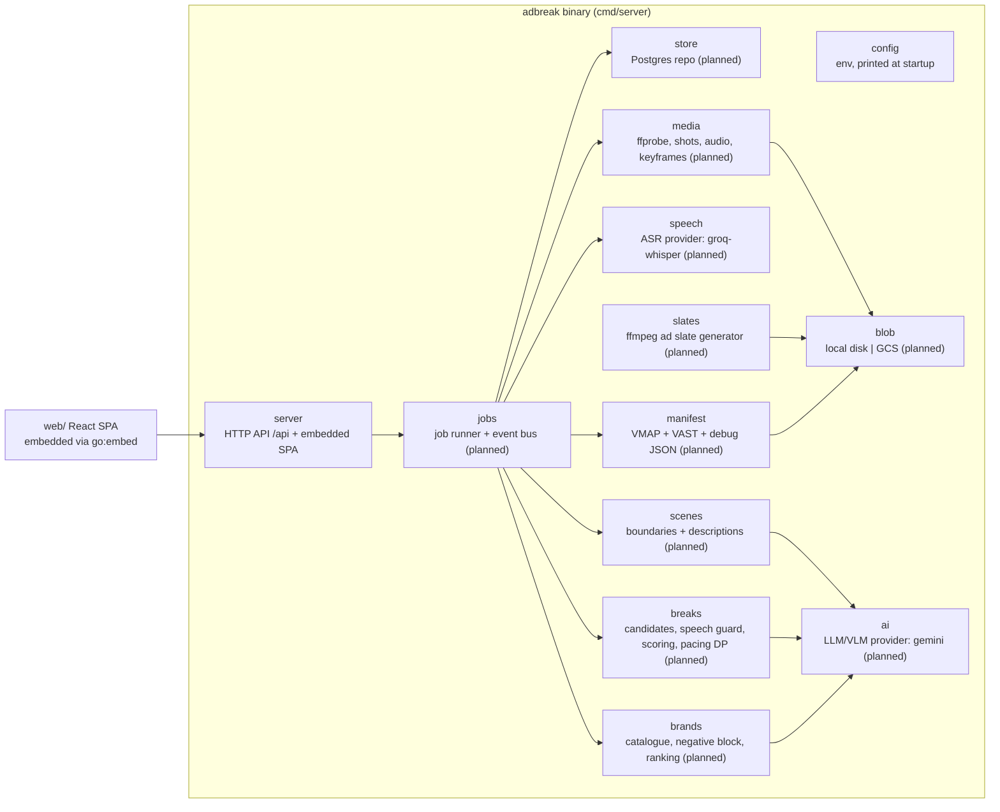
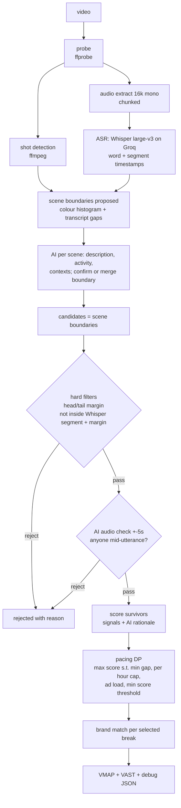
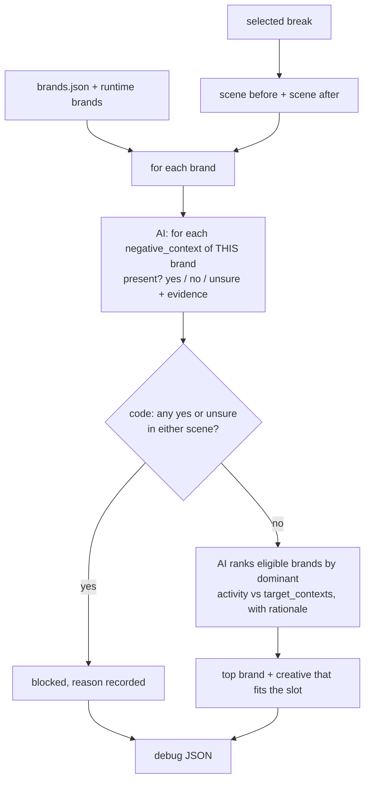
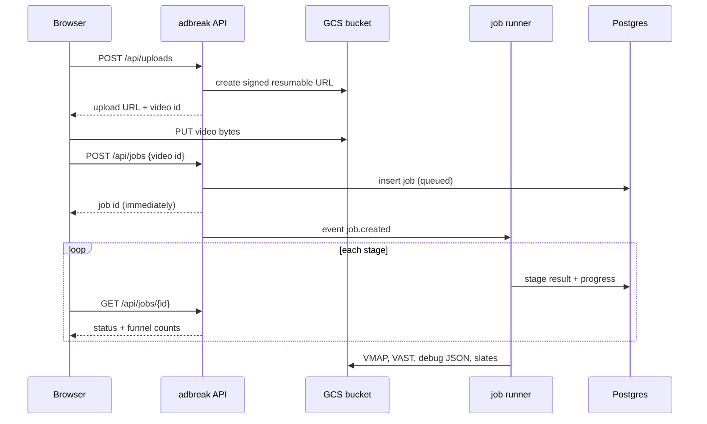
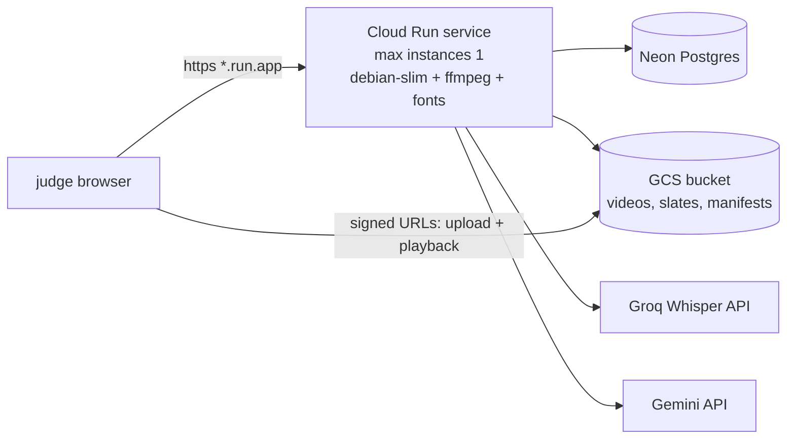

# Architecture

Every box and arrow here traces to a SCOPE.md item or a LOG.jsonl entry (cited as `LOG hh:mm`).
Rule: before changing code that touches architecture, re-read this file and verify it still matches
the code. If they disagree, stop and ask; never silently update one to match the other.
Items marked **(planned)** are decided but not built yet.

## 1. Modules (one Go binary)

Modular monolith, one process, one Cloud Run instance, in-process event bus (LOG 13:35).
Each box is a package under `internal/` with a small interface; `cmd/server` wires them.

Seams that would become services later, and why not yet: `speech` and `ai` are already
behind provider interfaces (self-hosted whisper.cpp / vLLM would slot in there, LOG 13:35);
`jobs` would split into an API + worker pool with a real queue once more than one instance
is needed. Today one instance handles the load, so a broker adds cost with no benefit.

## 2. Pipeline (the funnel)

Cheap deterministic stages first, AI only on survivors, code has the final say (LOG 13:35, 14:10).
Every stage records its input and output counts in the debug JSON.

## 3. Brand matching: model proposes, code guarantees

Negative contexts are a hard block per brand, never a soft penalty; uncertainty blocks;
both scenes around the break are checked; brands come from the catalogue at runtime,
so a 9th brand needs zero code change (LOG 13:35, SCOPE demo step 8).

## 4. Upload and job flow (planned)

Cloud Run caps request bodies at 32 MiB and a Cloudflare proxy would cut requests at 100 s,
so uploads go straight to GCS and processing is always async (LOG 13:35).

## 5. Deployment (planned)

Decided: Cloud Run + GCS + Neon Postgres, one instance, Rs 300 budget alert (LOG 13:35).
Deploy is deferred until Aranya is back (LOG 14:18).

Local dev mirrors this with Postgres in Docker, local disk instead of GCS, static ffmpeg (LOG 14:15).
